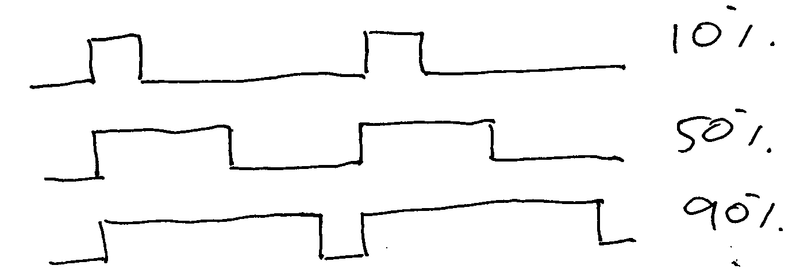
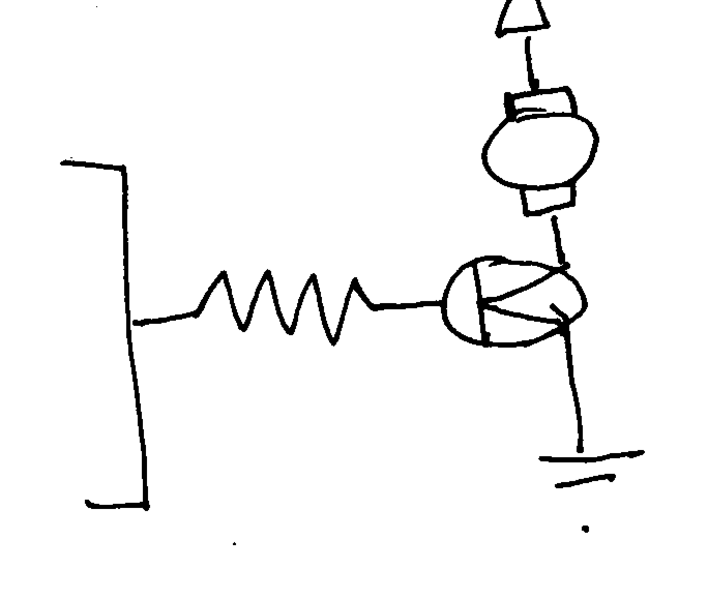
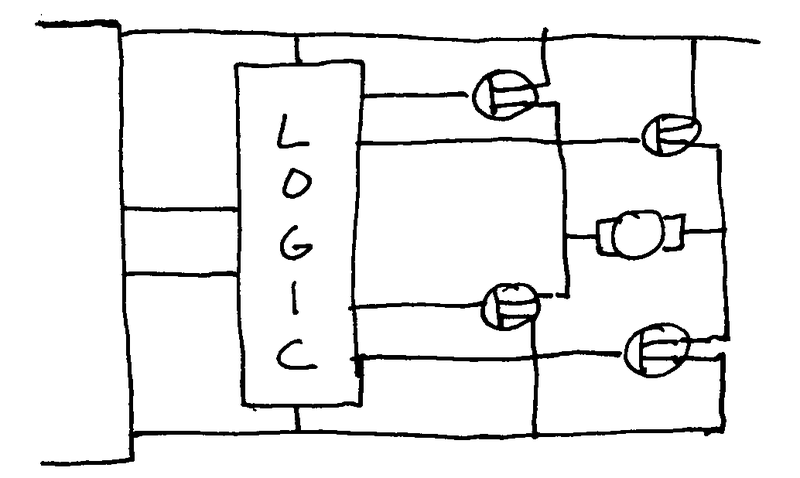
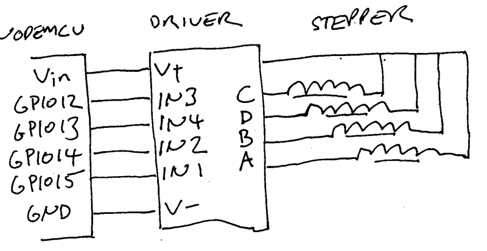

# MicroPython: Input and Output

This should work on either ESP8266 or ESP32 MicroPython, but the instructions are
written for ESP8266.  There are minor differences, eg: the numbers of pins and their
capabilities.

## I/O Pins

The number of pins, and their capabilities, varies between ESP8266 and ESP32, and 
not all pins are available on all boards.

### Witty Cloud (ESP8266)

The Witty Cloud development board has some hardware already on board, namely a 
three-colour LED and a light-dependent resistor.

ESP8266 | Connection
--------|-----------
GPIO0   | Flash button
GPIO2   | Module LED
GPIO4   | Pushbutton
GPIO12  | Blue LED
GPIO13  | Green LED
GPIO15  | Red LED

### NodeMCU (ESP8266)

Note that if you're using a NodeMCU board, the pin numbers printed on the board
are not the same as the ESP8266 GPIO numbers.
See https://nodemcu.readthedocs.io/en/master/en/modules/gpio/

NodeMCU | ESP8266 / MicroPython | Notes
--------|-----------------------|---------------
D0      | GPIO16                | Limited features, LED on NodeMCU
D1      | GPIO5                 |
D2      | GPIO4                 |
D3      | GPIO0                 | Connected to button
D4      | GPIO2                 | Connected to LED on module
D5      | GPIO14                | 
D6      | GPIO12                | 
D7      | GPIO13                | 
D8      | GPIO15                | 
D9      | GPIO3                 | UART RXD0 (used for console)
D10     | GPIO1                 | UART TXD0 (used for console)
D11     | GPIO9                 | (used for module flash memory)
D12     | GPIO10                | (used for module flash memory)

## MicroPython I/O

### Digital Outputs

To control an output pin, you must first configure it.  The `machine` library
makes the pins available to your Python code, and let's you specify how you
want to use that pin.  To configure a pin as a digital output::

     import machine
     pin = machine.Pin(2, machine.Pin.OUT)

On the ESP-12 module, GPIO2 is connected to an on-board LED, so you should be able to turn
the LED on and off::

     pin(True)
     pin(False)

Of course you can do this in a loop to get 'blinky', the microcontroller equivalent
of 'hello world'::

     import machine
     import time

     pin = machine.Pin(2, machine.Pin.OUT)
     while True:
         pin(True)
         time.sleep(1)
         pin(False)
         time.sleep(1)

### PWM Outputs

You can also turn the LED "partly on" by turning it on and off rapidly.  Doing this
in Python would be flickery and a waste of power, but thankfully there's hardware support
for pulse-width modulation (PWM).  This just means turning the pin on and off rapidly,
and it lets you set the proportion of the time the LED is on, called the 'duty cycle':

To configure a pin as PWM, wrap the `machine.Pin` object in a `machine.PWM` object::

    import machine
    pin = machine.Pin(2, machine.Pin.OUT)
    pwm = machine.PWM(pin)

    pwm.freq(1000)
    pwm.duty(512)

`freq` sets the frequency (in Hz) and `duty` sets the duty cycle between 0 (always off)
and 1023 (always on).  This lets you fade the LED in and out like so::

     import machine
     import time

     pin = machine.Pin(2, machine.Pin.OUT)
     pwm = machine.PWM(pin)
     pwm.freq(1000)

     while True:
         for d in range(0,1023,10):
             pwm.duty(d)
             time.sleep(0.01)
         for d in range(1023,0,-10):
             pwm.duty(d)
             time.sleep(0.01)

Yay, it's 'throbby', the microcontroller equivalent of "Hello, World!\n".

On the Witty Cloud, there are also LEDs attached to pins 12, 13 and 15, so you can
use three PWM channels to make interesting colour effects.

### Digital Inputs

The NodeMCU and Witty Cloud also have a button attached to GPIO0.  This can be used
to put the device into flash mode when it is reset, but once the device has started
it can be used as a general purpose input::

    import machine

    pin = machine.Pin(0, machine.Pin.IN)
    while True:
        if pin(): print "True"
        else: print "False" 
        
### Analog Inputs

There's also an analog input pin, sadly only one on ESP8266::

    import machine

    adc = machine.ADC(0)
    while True:
        print adc.read()

On the Witty Cloud this is attached to a Light Dependent Resistor.

## Controlling Hardware

### DC motors 

See also: [Wikipedia: Brushed DC Motors](https://en.wikipedia.org/wiki/Brushed_DC_electric_motor)

DC motors turn when there's a voltage across them.  But they need more current than our
IO Pins can supply, so we need a driver to amplify the signals from the MCU. This could
be as simple as a single transistor switched from an I/O pin.

Then you can turn the motor on and off using the pin::

    pin_motor = machine.Pin(4, machine.Pin.OUT)

The motor can be driven at different speeds by varying the duty cycle, just like with the
LED::

    pin_motor = machine.Pin(4, machine.Pin.OUT)
    pwm_motor = machine.PWM(pin_motor)

The motor can also be driven backwards by reversing the direction.  Internally the driver
uses an H-Bridge to do this, but all we need to know is that it has a reverse pin::

    pin_motor = machine.Pin(4, machine.Pin.OUT)
    pwm_motor = machine.PWM(pin_motor)

    pin_reverse = machine.Pin(5, machine.Pin.OUT) 

### Servos

Servos are very handy little units, consisting of a motor, a position sensor and a feedback
loop.  Rather than telling them which way to turn, you tell them what position you want them
to be in and they move to that position.  They are controlled by a train of pulses, for most
servos a pulse of 1.0 ms will turn the servo one way and a pulse of 2.0 ms will turn it the
other.  A pulse of 1.5 ms will put the servo in the middle.  Pulses must be received every
25 ms or so or the servo will turn off.  Servos are not all that precise, especially cheap
ones, so if you go past the acceptable range for the servo you may hear it whine as it tries
to move past its limits, or it may 'hunt' (wiggle back and forth) if it isn't happy with
the frequency of the pulses.

There are three pins:

Wire color | Purpose | NodeMCU Pin
-----------|---------|------------
Brown      | Ground  | GND
Red        | Power   | Vin
Orange     | Signal  | D4

Thankfully this is easy enough to do with the PWM control.  Set the frequency to 100Hz (one
cycle per 10ms) and the duty cycle to between 0.1 (10ms * 0.1 = 1ms) and 0.2 (10ms * 0.2 = 2ms)
We can adapt the LED PWM code above::

    import machine
    import time

    pin = machine.Pin(2, machine.Pin.OUT)
    pwm = machine.PWM(pin)
    pwm.freq(100)

    while True:
        for d in range(100,200):
            pwm.duty(d)
            time.sleep(0.1)

### Stepper Motors

Stepper motors have multiple separate coils, and unlike DC motors there's no brushes to switch
the current around and keep things spinning, instead you have to do it yourself.  The two
separate phases need to be controlled separately.

For more details: [Wikipedia: Stepper Motors](https://en.wikipedia.org/wiki/Stepper_motor)

Phase | A+ | A- | B+ | B-
------|----|----|----|----
0     | 1  | 0  | 0  | 0
1     | 1  | 0  | 1  | 0
2     | 0  | 0  | 1  | 0
3     | 0  | 1  | 1  | 0
4     | 0  | 1  | 0  | 0
5     | 0  | 1  | 0  | 1
6     | 0  | 0  | 0  | 1
7     | 1  | 0  | 0  | 1

This means you have more work to do, but you also have more control::

    import machine
    import time

    pins = [
        machine.Pin(12, machine.Pin.OUT),  # 1
        machine.Pin(13, machine.Pin.OUT),  # 2
        machine.Pin(14, machine.Pin.OUT),  # 4
        machine.Pin(15, machine.Pin.OUT),  # 8
    ]

    phases = [ 1, 5, 4, 6, 2, 10, 8, 9 ]

    while True:
        for phase in phases:
            for n, p in enumerate(pins):
                pins[n](phase & 1<<n)
            time.sleep(0.001)

Wiring
~~~~~~

As a demo, I have some [28BYJ-48 4-phase unipolar geared stepper motors](http://robocraft.ru/files/datasheet/28BYJ-48.pdf)
[ULN2003A](https://en.wikipedia.org/wiki/ULN2003A) driver boards
to suit.  Despite being designed for 5V TTL logic these work well enough
on 3.3V CMOS.

Wire NodeMCU GND to V- and NodeMCU Vin to V+, and the logic pins as follows:

ESP8266 | NodeMCU | Driver | LED | Phase
--------|---------|--------|-----|-------
GPIO12  | D6      | IN3    | C   | B-
GPIO13  | D7      | IN4    | D   | A-
GPIO14  | D5      | IN2    | B   | B+
GPIO15  | D8      | IN1    | A   | A+
